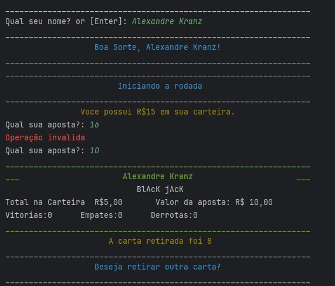

### vinteUm

Este jogo em formato de script foi criado em 2020, antes de eu iniciar o curso de Engenharia de Software.
Resgatei-o de meus backups e estou trazendo ele aqui, da forma que foi concebido na época.

O objetivo consiste em voce acumular a maior quantidade de dinheiro até que termine as cartas. Eventualmente voce pode terminar o jogo antes de acabar as cartas, se zerar seu dinheiro na carteira.
Ganha a rodada quem tiver o numero mais alto, mas que não ultrapasse 21 pontos. O inicio da rodada, é sorteada uma carta e voce decide se quer tirar outra carta, assim somando-se os pontos de cada carta retirada. Após voce decidir parar, é a vez da mesa jogar. Se voce vencer a rodada, o valor apostado vem para a tua carteira, e soma-se 1 vitoria no teu ranking. Após o termino do jogo, os dados são salvos no arquivo .txt.

Abaixo algumas imagens do jogo rodando, do arquivo de recordes criado, e um pequeno trecho do codigo.

[Veja o vídeo no YouTube](https://www.youtube.com/watch?v=U_PEWAe_XAY&ab_channel=AlexandreKranz)

---
 

 

⚙ O desenvolvimento de software é uma arte em constante evolução - nunca se contente com o suficiente. ⚙
